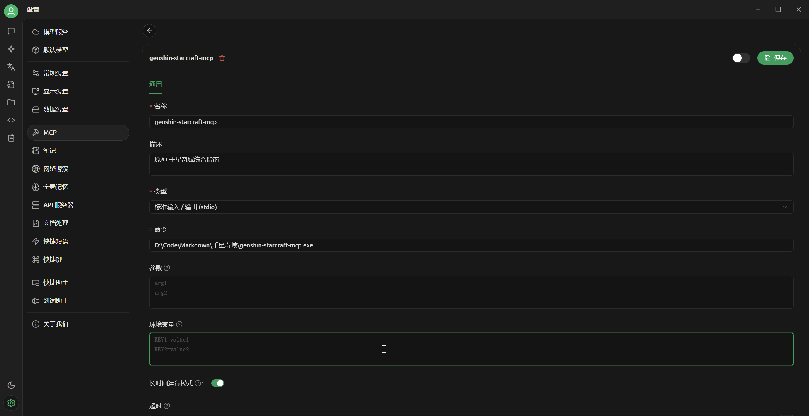
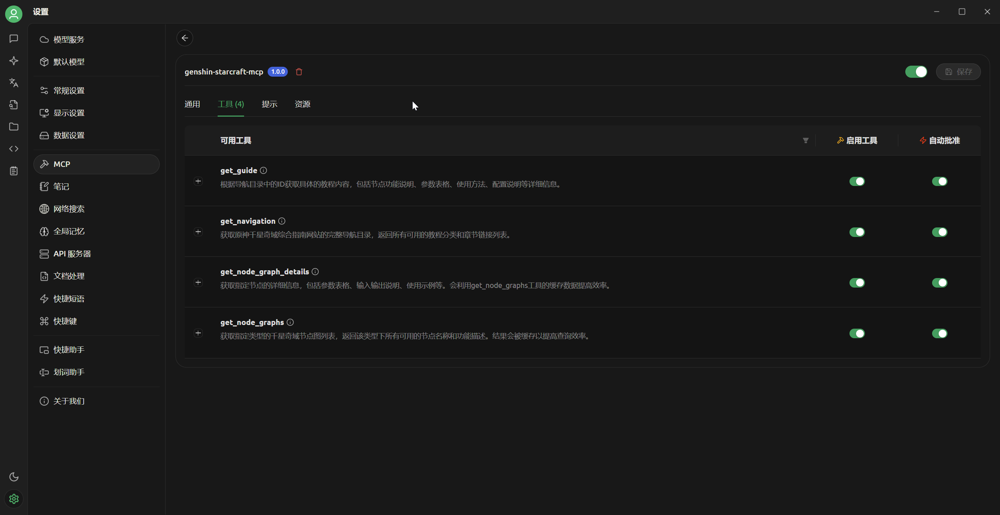
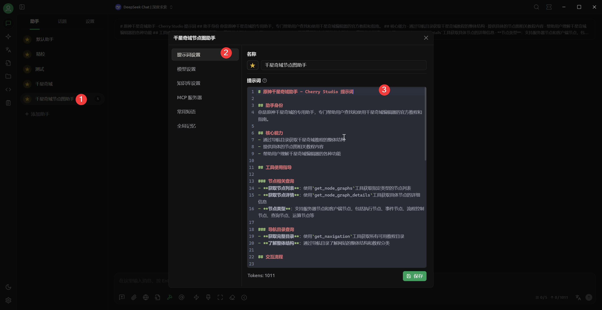
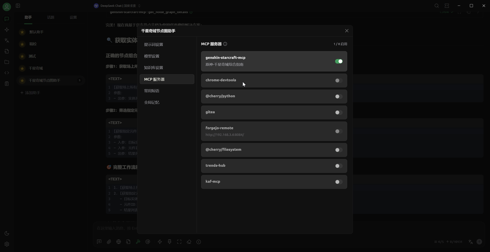
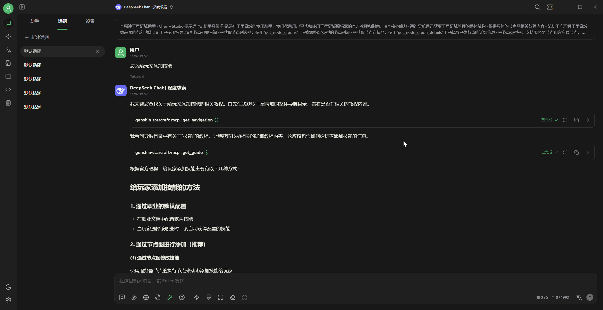

# 原神千星奇域教程 MCP 服务器

一个专为《原神·千星奇域》地图编辑器设计的 MCP (Model Context Protocol) 服务器，提供实时访问官方教程和节点文档的功能。

## 核心功能

### 🗺️ 导航目录查询
- 获取完整的官方教程结构
- 支持分类浏览所有可用教程
- 提供详细的教程ID和链接

### 📊 节点图查询系统
- **客户端节点**: 查询节点、运算节点、执行节点、流程控制节点、其它节点
- **服务器节点**: 执行节点、事件节点、流程控制节点、查询节点、运算节点
- 智能缓存机制提高查询效率
- 按功能分类组织节点列表

### 📋 详细文档获取
- 节点参数表格完整展示
- 输入输出参数详细说明
- 使用示例和配置指南
- 原文链接和参考信息

## Cherry Studio 配置指南

### 环境要求
- [Cherry Studio](https://www.cherry-ai.com/) (支持MCP协议的AI客户端)

### 1. 获取MCP服务器

#### 下载预编译版本（推荐）
1. 访问项目Release页面：`https://github.com/用户名/genshin-starcraft-mcp/releases`
2. 下载适合你操作系统的最新版本
   - Windows: `genshin-starcraft-mcp-windows.exe`
   - Linux: `genshin-starcraft-mcp-linux`
   - macOS: `genshin-starcraft-mcp-macos`
3. 将可执行文件放置到合适的位置

### 2. Cherry Studio 配置

#### Cherry Studio 配置步骤
1. 打开 Cherry Studio 设置
2. 找到 MCP 服务器配置
3. 添加新的MCP服务器：
   ```
   名称: 原神千星奇域教程
   命令: /path/to/your/genshin-starcraft-mcp
   ```
   - Windows: `C:\path\to\genshin-starcraft-mcp-windows.exe`
   - Linux/macOS: `/path/to/genshin-starcraft-mcp-linux`
   
   
   
4. 创建新的助手
把[提示词](assistant_prompt.md) 或 [精简版提示词](cherry_studio_prompt.txt) 填到提示词设置里
  
  
   

### 3. 验证配置
创建一个聊天， 问助手： 怎么给玩家添加技能



## 技术特点

- **Go + rod**: 高性能无头浏览器操作，支持复杂的页面交互
- **MCP协议**: 基于标准MCP协议，兼容多种AI客户端
- **智能缓存**: 节点查询结果缓存，显著提高查询效率
- **结构化数据**: 完整的参数表格和输入输出说明
- **实时更新**: 直接访问官方教程网站，获取最新信息

## 故障排除

### 常见问题

**1. Cherry Studio无法连接**
- 确认MCP服务器正在运行
- 检查配置文件中的路径是否正确
- 尝试重启Cherry Studio

**2. 查询无结果**
- 检查网络连接
- 确认参数名称正确
- 查看服务器日志输出

### 调试模式
启用调试日志， 在环境变量添加：
```bash
DEBUG=1
```
然后在和mcp相同目录下会有 `genshin-starcraft-mcp.log` 文件

### 自行编译（仅限开发者）
```bash
# 克隆项目
git clone <项目地址>
cd genshin-starcraft-mcp

# 安装依赖
go mod tidy

# 构建服务器
go build -o genshin-starcraft-mcp cmd/server/main.go
```

#### 运行测试
配置完成后，启动MCP服务器进行测试：
```bash
# Windows
./genshin-starcraft-mcp-windows.exe

# Linux
./genshin-starcraft-mcp-linux

# macOS
./genshin-starcraft-mcp-macos
```

## 项目架构

```
genshin-starcraft-mcp/
├── cmd/
│   └── server/
│       └── main.go           # 服务器启动入口
├── pkg/
│   ├── mcp/
│   │   └── server.go         # MCP服务器核心实现
│   ├── scraper/              # 网页抓取模块
│   │   ├── browser.go        # 浏览器控制和导航
│   │   ├── search.go         # 搜索功能实现
│   │   └── node.go           # 节点查询和处理
│   ├── models/               # 数据模型定义
│   │   └── tutorial.go       # 教程和节点数据结构
│   └── utils/
│       └── logger.go         # 日志工具
├── cherry_studio_prompt.txt  # Cherry Studio 提示词
├── assistant_prompt.md       # 通用助手提示词
├── go.mod
├── go.sum
└── README.md
```

## 许可证

MulanPSL2 License